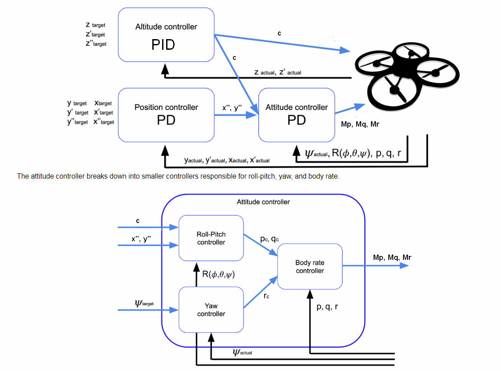
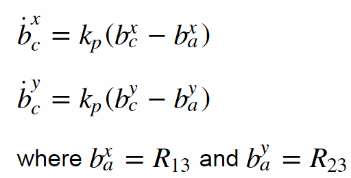
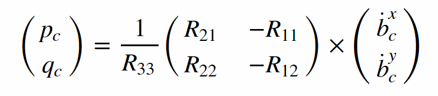
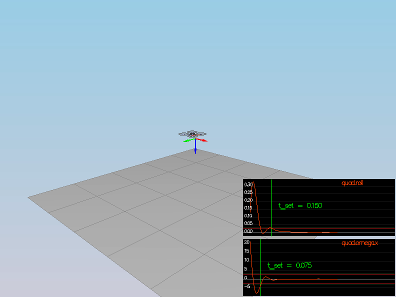
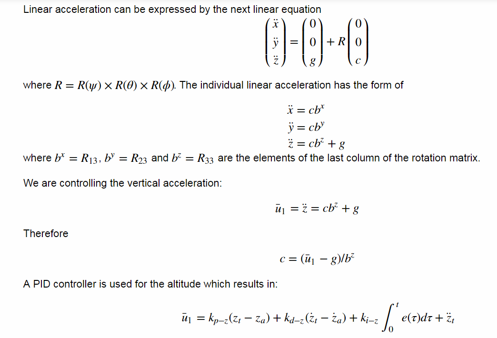
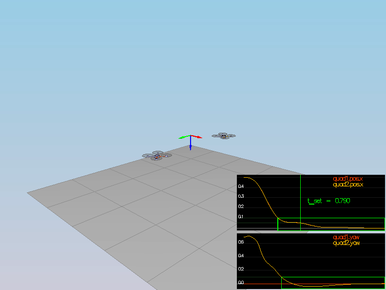
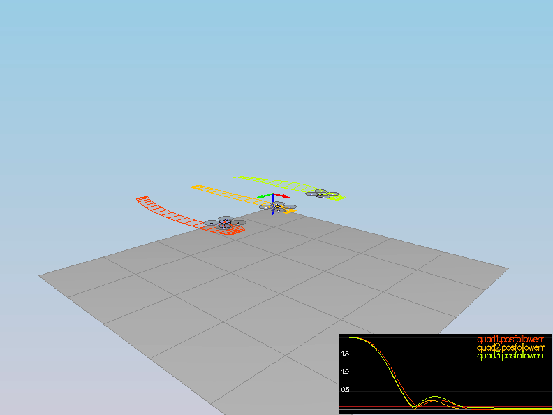
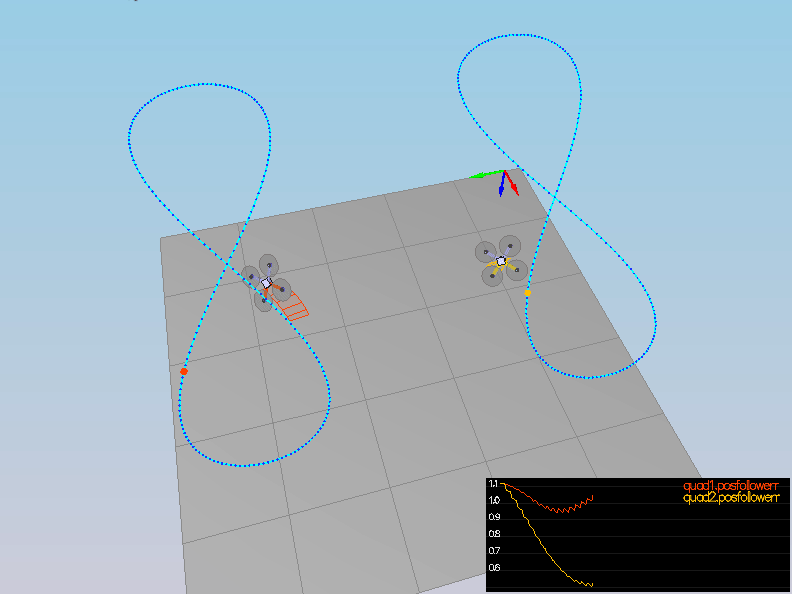

# Quadcopter Controller in C++ Writeup #
### Project 3 of the Udacity Flying Car Nanodegree ###

This is the readme for the C++ project and describes the implementation of a cascaded PID controller for a quadcopter simulation. The following figure describes the controller architecture:


The inputs/outputs differs slightly from the lessons.

### Intro (scenario 1) ###

If the mass of the quadcopter is not set correctly in `QuadControlParams.txt` the copter either falls down or rise up. This is due to the fact that the thrusts are simply being set to:

```
QuadControlParams.Mass * 9.81 / 4
```

Tuning the `Mass` parameter to 0.5 the copter hovers.

### Body rate and roll/pitch control (scenario 2) ###

Goal: In scenario 2, you will see a quad above the origin.  It is created with a small initial rotation speed about its roll axis.  Your controller will need to stabilize the rotational motion and bring the vehicle back to level attitude.

Steps to accomplish this:

1. Implement body rate control

 - In `GenerateMotorCommands()` following equations are implemented and the desired thrusts for each rotor are calculated. Note that F3 and F4 are swapped compared to lessons.

 

 - In `BodyRateControl()` a simple P controller is used to get the desired rotational accelerations in the body frame `p_dot, q_dot, r_dot` as `p_term` and translated these acceleration to moments by mutliplying them with corresponding inertias.
 
 - Tuned `kpPQR` in `QuadControlParams.txt` to get the vehicle to stop spinning quickly but not overshoot

The rotation of the vehicle about roll (omega.x) get controlled to 0 while other rates remain zero.  Note that the vehicle will keep flying off quite quickly, since the angle is not yet being controlled back to 0.  Also note that some overshoot will happen due to motor dynamics!.

2. Implement roll / pitch control
We won't be worrying about yaw just yet.

 - In the function `RollPitchControl()` again a simple P controller is implemented to control lateral acceleration. The inputs for this functions are the commanded accelerations in the x and y direction and the desired collective thrust. These inputs are translated to elements in the rotation matrix and used for the P controller. 
 
   
 As outputs we need roll and pitch rates, so we need to apply the following equation:
 
 

 - Tuned `kpBank` in `QuadControlParams.txt` to minimize settling time but avoid too much overshoot

After tuning the parameters the quad levels itself (as shown below), though it’ll still be flying away slowly since we’re not controlling velocity/position! The vehicle angle (Roll) get controlled to 0 as well.

 

### Position/velocity and yaw angle control (scenario 3) ###

In scenario 3 two identical quads, one offset from its target point (but initialized with yaw = 0) and second offset from target point but yaw = 45 degrees, have to be controlled. 

 - In `LateralPositionControl()` a feedforward PD controller is implemented to output an acceleration command based on position and velocity. No transformations have to be done here but the velocity and acceleration commands are checked for feasibility.
 - The `AltitudeControl()` function implements a PID controller. Here the math for this controller 
 
 
 - Tuned parameters `kpPosZ` and `kpPosZ`
 - Tuned parameters `kpVelXY` and `kpVelZ`

Now the copters are going to their destination points and tracking error is going down (as shown below). However, one quad remains rotated in yaw.

 - To fix this the `YawControl()` function implements a P controller for the actual/commanded yaw. Attention has to be paid to unwrap the radian angle in the yaw command and error. 
 - Tune parameters `kpYaw` and the 3rd (z) component of `kpPQR`

 

### Non-idealities and robustness (scenario 4) ###

After tuning each controller for itself and in a perfect world, now we explore some of the non-idealities and robustness of the controllers.  For this simulation, we will use `Scenario 4`.  This is a configuration with 3 quads that are all are trying to move one meter forward.  However, this time, these quads are all a bit different:
 - The green quad has its center of mass shifted back
 - The orange vehicle is an ideal quad
 - The red vehicle is heavier than usual

At first place the movement of the copters didn't look right and the parameters had to be tuned again and actually here the integral part of the altitude controller (see section above) was added to handle residual errors

 

### Tracking trajectories (scenario 5) ###

In scenario 5 two quadcopters are following a 8 shaped trajectory. To pass this test the parameters had to be tuned again and the command outputs from the controllers must be constrained, like max thrust and tilt angles.

 
 
## References ##

- Thanks to Fotokite for the initial development of the project code and simulator.
- Udacity Self Flying Nanodegree
