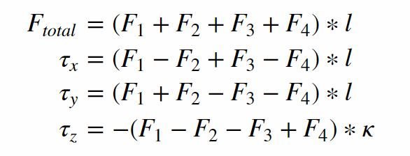

# Quadcopter Controller in C++ Writeup #
### Project 3 of the Udacity Flying Car Nanodegree ###

This is the readme for the C++ project.

For easy navigation throughout this document, here is an outline:

 - [The tasks](#the-tasks)
 - [Evaluation](#evaluation)

### The Code ###

For the project, the majority of your code will be written in `src/QuadControl.cpp`.  This file contains all of the code for the controller that you will be developing.

All the configuration files for the controller and the vehicle are in the `config` directory.  For all control gains and other desired tuning parameters, there is a config file called `QuadControlParams.txt`. An import note is that while the simulator is running, you can edit this file in real time and see the affects your changes have on the quad!

2. **Parameter Ranges**: You can find the vehicle's control parameters in a file called `QuadControlParams.txt`. The default values for these parameters are all too small by a factor of somewhere between about 2X and 4X. So if a parameter has a starting value of 12, it will likely have a value somewhere between 24 and 48 once it's properly tuned.

3. **Parameter Ratios**: In this [one-page document](https://www.overleaf.com/read/bgrkghpggnyc#/61023787/) you can find a derivation of the ratio of velocity proportional gain to position proportional gain for a critically damped double integrator system. The ratio of `kpV / kpP` should be 4.

### Intro (scenario 1) ###

It the mass of the quadcopter is not set correctly in `QuadControlParams.txt` the copter either falls down or rise up. This is due to the fact that the thrusts are simply being set to:

```
QuadControlParams.Mass * 9.81 / 4
```

Tuning the `Mass` parameter to 0.5 the copter hovers.


<p align="center">

</p>


### Body rate and roll/pitch control (scenario 2) ###

Goal: In scenario 2, you will see a quad above the origin.  It is created with a small initial rotation speed about its roll axis.  Your controller will need to stabilize the rotational motion and bring the vehicle back to level attitude.

Steps to accomplish this:

1. Implement body rate control

 - In `GenerateMotorCommands()` following equations are implemented and the desired thrusts for each rotor are calculated. Note that F3 and F4 are swapped compared to lessons.

 

 - In `BodyRateControl()` a simple P controller is used to get the desired rotational accelerations in the body frame `p_dot, q_dot, r_dot` as `p_term` and translated these acceleration to moments by mutliplying them with corresponding inertias.
 
 - Tuned `kpPQR` in `QuadControlParams.txt` to get the vehicle to stop spinning quickly but not overshoot

If successful, you should see the rotation of the vehicle about roll (omega.x) get controlled to 0 while other rates remain zero.  Note that the vehicle will keep flying off quite quickly, since the angle is not yet being controlled back to 0.  Also note that some overshoot will happen due to motor dynamics!.

If you come back to this step after the next step, you can try tuning just the body rate omega (without the outside angle controller) by setting `QuadControlParams.kpBank = 0`.

2. Implement roll / pitch control
We won't be worrying about yaw just yet.

 - In the function `RollPitchControl()` again a simple P controller is implemented to control lateral acceleration. The inputs for this functions are the commanded accelerations in the x and y direction and the desired collective thrust. These inputs are translated to elements in the rotation matrix and used for the p controller. 
   
 As outputs we need roll and pitch rates, so we need to apply the following equation:
 

 - Tune `kpBank` in `QuadControlParams.txt` to minimize settling time but avoid too much overshoot

If successful you should now see the quad level itself (as shown below), though it’ll still be flying away slowly since we’re not controlling velocity/position!  You should also see the vehicle angle (Roll) get controlled to 0.

<p align="center">

</p>


### Position/velocity and yaw angle control (scenario 3) ###

Next, you will implement the position, altitude and yaw control for your quad.  For the simulation, you will use `Scenario 3`.  This will create 2 identical quads, one offset from its target point (but initialized with yaw = 0) and second offset from target point but yaw = 45 degrees.

 - In `LateralPositionControl()` a feedforward PD controller is implemented to output an acceleration command based on position and velocity. 
 - The `AltitudeControl()` function implements PID controller 
 - tune parameters `kpPosZ` and `kpPosZ`
 - tune parameters `kpVelXY` and `kpVelZ`

If successful, the quads should be going to their destination points and tracking error should be going down (as shown below). However, one quad remains rotated in yaw.

 - implement the code in the function `YawControl()`
 - tune parameters `kpYaw` and the 3rd (z) component of `kpPQR`

Tune position control for settling time. Don’t try to tune yaw control too tightly, as yaw control requires a lot of control authority from a quadcopter and can really affect other degrees of freedom.  This is why you often see quadcopters with tilted motors, better yaw authority!

<p align="center">

</p>

**Hint:**  For a second order system, such as the one for this quadcopter, the velocity gain (`kpVelXY` and `kpVelZ`) should be at least ~3-4 times greater than the respective position gain (`kpPosXY` and `kpPosZ`).

### Non-idealities and robustness (scenario 4) ###

In this part, we will explore some of the non-idealities and robustness of a controller.  For this simulation, we will use `Scenario 4`.  This is a configuration with 3 quads that are all are trying to move one meter forward.  However, this time, these quads are all a bit different:
 - The green quad has its center of mass shifted back
 - The orange vehicle is an ideal quad
 - The red vehicle is heavier than usual

1. Run your controller & parameter set from Step 3.  Do all the quads seem to be moving OK?  If not, try to tweak the controller parameters to work for all 3 (tip: relax the controller).

2. Edit `AltitudeControl()` to add basic integral control to help with the different-mass vehicle.

3. Tune the integral control, and other control parameters until all the quads successfully move properly.  Your drones' motion should look like this:

<p align="center">

</p>


### Tracking trajectories ###

Now that we have all the working parts of a controller, you will put it all together and test it's performance once again on a trajectory.  For this simulation, you will use `Scenario 5`.  This scenario has two quadcopters:
 - the orange one is following `traj/FigureEight.txt`
 - the other one is following `traj/FigureEightFF.txt` - for now this is the same trajectory.  For those interested in seeing how you might be able to improve the performance of your drone by adjusting how the trajectory is defined, check out **Extra Challenge 1** below!

How well is your drone able to follow the trajectory?  It is able to hold to the path fairly well?


### Extra Challenge 1 (Optional) ###

You will notice that initially these two trajectories are the same. Let's work on improving some performance of the trajectory itself.

1. Inspect the python script `traj/MakePeriodicTrajectory.py`.  Can you figure out a way to generate a trajectory that has velocity (not just position) information?

2. Generate a new `FigureEightFF.txt` that has velocity terms
Did the velocity-specified trajectory make a difference? Why?

With the two different trajectories, your drones' motions should look like this:

<p align="center">

</p>


### Extra Challenge 2 (Optional) ###

For flying a trajectory, is there a way to provide even more information for even better tracking?

How about trying to fly this trajectory as quickly as possible (but within following threshold)!


## Evaluation ##

To assist with tuning of your controller, the simulator contains real time performance evaluation.  We have defined a set of performance metrics for each of the scenarios that your controllers must meet for a successful submission.

There are two ways to view the output of the evaluation:

 - in the command line, at the end of each simulation loop, a **PASS** or a **FAIL** for each metric being evaluated in that simulation
 - on the plots, once your quad meets the metrics, you will see a green box appear on the plot notifying you of a **PASS**


### Performance Metrics ###

The specific performance metrics are as follows:

 - scenario 2
   - roll should less than 0.025 radian of nominal for 0.75 seconds (3/4 of the duration of the loop)
   - roll rate should less than 2.5 radian/sec for 0.75 seconds

 - scenario 3
   - X position of both drones should be within 0.1 meters of the target for at least 1.25 seconds
   - Quad2 yaw should be within 0.1 of the target for at least 1 second


 - scenario 4
   - position error for all 3 quads should be less than 0.1 meters for at least 1.5 seconds

 - scenario 5
   - position error of the quad should be less than 0.25 meters for at least 3 seconds

## Authors ##

Thanks to Fotokite for the initial development of the project code and simulator.